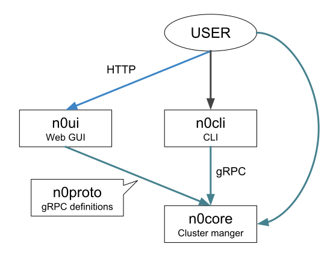

# n0stack

## Motivation

現在のOpenstackやKubernetesは以下のような問題を抱えていると考えている。

- Openstackやkubernetesは汎用性を求めすぎてオプションの量がしんどい (k8sはまともだけど)
  - もちろん開発者が多く、いいプロダクトだと思うのですみわけをしていきたい
    - Openstackは構築コストが低い検証環境のIaaS基盤として
    - Kubernetesは...
- プロダクション環境は結局自社に合わせたインフラが必要になるが、たいていは完全に合致しないためある程度書き換えないといけない
  - 結局ソースコードを全部理解するような人が必要で、そこからいい感じに書き換えるか互換のあるものを作るというコストは結構高い
  - 設定を四苦八苦するよりもわかりやすくて短いソースを読んだほうが理解できるし、何なら自分で書いたほうがいい

以上を踏まえ我々は、 *最初から自分で最高に合致するものを書けばよい* という結論に至った。よって開発するにあたって以下のことを前提とする。

- コードは短く、シンプルに、汎用性の一切を排除
  - オプションも最小限に
- gRPCでインターフェイスはしっかり定義してやる
  - OSSの再利用性を確保するため
    - 例えばComputeの実装はそのまま使えるけどNetworkだけ機材が違うから書き換えたいなど
  - provisioning(リソースの仮想化)、middleware(SaaS)、application(アプリケーションの抽象化)、service(サービスの抽象化)など抽象化するレベルを分ける
- 我々が作るメインストリームはあくまでモデルケース
  - 変える必要があれば各自がフォークして良しなにやること

加えて、個人的に楽しいので可能な限り新しく面白い技術を採用していく。

## Components 

### n0proto

Protobuf definitions for all of n0stack services

### n0ui

Web UI for n0stack API

### n0cli

CLI for n0stack API

### n0core

The example for implementations about n0stack API
