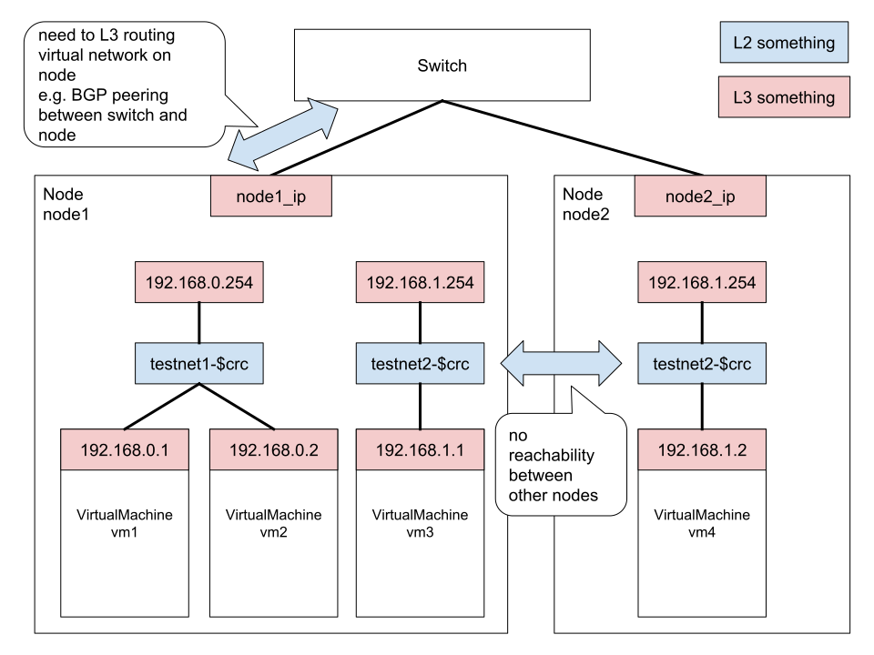

# n0core

The example for implementation of n0stack API.

## Environment

- Ubuntu 18.04 LTS (Bionic Beaver)
- Golang 1.11

## How to deploy

### API

- Requires Docker and docker-compose

```
cd deploy/api
docker-compose up
```

### Agent

Check agent arguments with `n0core serve agent -h`.

#### Remote

- Require root user
- Perform the following processing
    - Send self to `/var/lib/n0core/n0core.$VERSION` with sftp
    - Run `n0core local`

```sh
docker run -it --rm -v $HOME/.ssh:/root/.ssh n0stack/n0stack \
    /usr/bin/n0core deploy agent \
        -i /root/.ssh/id_ecdsa \
        root@$node_ip \
            $agent_args
```

##### Example

```sh
docker run -it --rm -v $HOME/.ssh:/root/.ssh n0stack/n0stack \
    /usr/bin/n0core deploy agent \
        -i /root/.ssh/id_ecdsa \
        root@$node_ip \
            --advertise-address=$node_ip \
            --node-api-endpoint=$api_ip:20180 \
            --location=////1
```

#### Local

- Require root user
- Perform the following processing
    - If n0core service is started, stop n0core service.
    - Create symbolic link from self to `/usr/bin/n0core`
    - Generate systemd unit file and start systemd service

```sh
bin/n0core install agent -a "$agent_args"
```

## Design

### VirtualMachine

| Features | Yes / No |
|--|--|
| Redundancy | No |
| Scalability | Yes |

### BlockStorage

| Features | Yes / No |
|--|--|
| Redundancy | No |
| Scalability | Yes |

### Network

| Features | Yes / No |
|--|--|
| Redundancy | No |
| Scalability | No (for each network) |



## How to develop

- see also [Makefile](../Makefile)

### Build

```sh
cd ..
make build-builder # once
make build-n0core
```

### Run API

```sh
cd ..
make up
```

### Run Agent

- Recommended way is...
    1. Boot VM
    2. `n0core deploy` to booted VM
